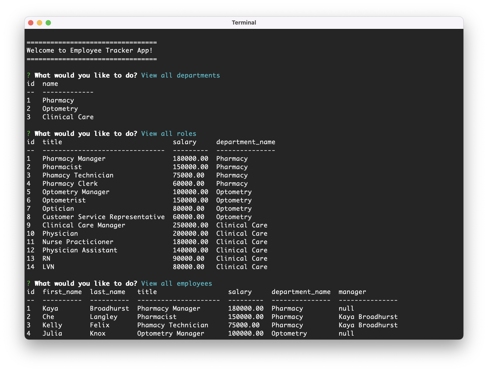

# Employee Tracker App

  
  
 
  
  ## Description

  Employee Tracker App is a command line application that allows you to manage a company's employee database. Technologies used in this application include Node.js, MySQL, and Inquirer.  
   

  ## Table of Contents

  - [Installation](#installation)
  - [Usage](#usage)
  - [License](#license)
  - [Questions](#questions)  
   

  ## Installation

  Use the following command to download dependencies for the project:  
  ~~~
  npm install
  ~~~
   

  ## Usage

  Application can be invoked from the command line using npm start. The main menu allows for the following options: 

  - View all departments
  - View all roles
  - View all employees
  - Add a role
  - Add an employee
  - Update an employee role

  Follow along with the prompts to generate a formatted table of the requested information.

  [Example Video](https://drive.google.com/file/d/1xxD6lpHk0ZCw2UK2HTkGW0dY7TcKQzQQ/view)

  

   

## License 

  This project is licensed under the [MIT License](https://choosealicense.com/licenses/mit/).  
   

  ## Questions

  [GitHub](https://github.com/dneflas)  

